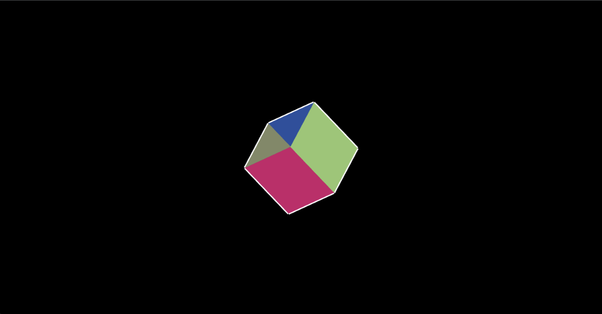

# js-cube
Q: 그 혹시, "게임엔진" 만들 수 있어요? A: 아뇨 전 수학을 못해서요. Q: 그것도 못만드면서 나대지마

# 이게 대체 무슨 혼종이냐

대충 3d 라이브러리 없이 큐브 그리는 프로젝트. 사실 별거 없고 그냥 심심해서 만들어 봤다는게 학계의 룰.

사실 이 플밍 업계는 삽질 노가다 광기의 직종이라 이런 사이드 프로젝트 안하면 인생이 지겨워서 견딜수가 없음. 가끔 뻘짓도 하고 광기에 서리면서 살아야 정신 멀쩡하게 살아갈 확률이 높음.

# 이 프로그래밍 업계는.

삽질의 장인 or 노가다 ororororororororororor 천재. 만 있는 괴상한 사람들이 모여있는 미친 업계. 나의 경우에는 삽질이 적성에 맞아서 그런지 안되는거 하루에 10시간 붙들고 있으면 언젠가 됨. 항상 신기했던게 어떻게든 컴퓨터 앞에 앉아만 있으면 되더라고.

그래서인지 카페인을 멀리하게 됨. 보통 반대긴 한데, 삽질 잘하는 사람 중에서 뭐에 중독된 사람 못봄. 왜냐면 그 삽질이 너무 중독적이여서 다른건 눈에도 안들어옴.

# 왜 프로그래밍을 배우라 하는지.

인내심 기르는데 프로그래밍 만한게 없음. 뭐만 하면 지 혼자 죽어버리는게 그 원인은 100% 나에게 있음. 어려운 문제를 7일만에 해결하면 7분내로 또 다른 버그에 날라와서 똥 싸두고 감. 근데 벌레가 깨끗하게 청소한데에 올리가 없지. 내 코드가 더러워서 버그가 꼬임. 진짜 이걸 오래 하다보면 자괴감들떄가 많음. 그때마다 계속 이겨내다보면 언젠가 나를 믿게되는 순간이 오고 인내심이 공자 수준으로 끌어올려짐.

왜 프로그래밍을 배워야 하냐고? 논리력? 사고력? 그딴거 살아가는데 다 필요 없고 '인내심' 이거 하나 기르려고 배워야 하는거.